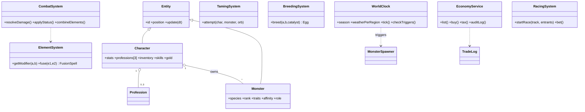

# GAME DESIGN DOCUMENT
## Project "AETHERION" — 2D Fantasy Sandbox MMORPG
**Versi:** 0.1 (Working Draft) | **Status:** Pre-Production | **Target Tim:** Indie (5–15 orang)

---

# BAGIAN 1 — IDENTITAS GAME

## 1.1 High Concept
Sandbox MMORPG 2D pixel art HD di mana **dunia bereaksi terhadap pemain**: musim, cuaca, dan perilaku pemain (menebang pohon, membunuh monster, mendominasi ekonomi) memicu event, monster rahasia, dan perubahan dunia. Identitas unik game ini bukan sekadar gabungan referensi, melainkan tiga pilar berikut.

## 1.2 Tiga Pilar Desain (Design Pillars)
Setiap keputusan desain harus lolos uji tiga pilar ini:

**Pilar 1 — Living World (Dunia yang Hidup).**
Cuaca, musim, dan aksi kolektif pemain mengubah spawn monster, resource, dan event. Tidak ada dua minggu yang terasa sama.

**Pilar 2 — Identity Through Combination (Identitas lewat Kombinasi).**
Kekuatan pemain lahir dari kombinasi: 3 profesi × elemen × monster fusion × rune. Tidak ada "build terbaik tunggal"; ada ribuan identitas build.

**Pilar 3 — Player-Driven Everything.**
Ekonomi, crafting tier tertinggi, dan konten sosial (racing, guild war, marketplace) digerakkan pemain, bukan NPC. NPC hanya safety net.

## 1.3 Perbandingan Referensi → Apa yang Diambil
| Referensi | Elemen yang diadaptasi | Apa yang TIDAK diambil |
|---|---|---|
| Terraria | Sandbox gathering, world event, boss trigger | Terrain destruction penuh (terlalu berat untuk MMO) |
| Ragnarok Online | Struktur job/profesi, ekonomi pemain, kartu/enchant | Grinding tanpa arah |
| Palworld / Pokémon | Taming, breeding, companion | Jumlah spesies ratusan di launch (mulai 60–80) |
| Monster Hunter | Material dari monster → crafting | Combat 3D kompleks |
| Magicka | Kombinasi elemen bebas | Friendly-fire chaos |
| RuneScape | Skill/profesi terpisah level, ekonomi GE | — |
| Seven Knights | Progression koleksi & rarity | Gacha karakter (anti-P2W) |

## 1.4 Platform & Teknis Ringkas
- **Target:** PC (utama), Mobile (fase 2), cross-platform account & server.
- **Kontrol:** WASD + mouse (PC), virtual joystick + auto-target ringan (mobile).
- **Sesi ideal:** 20–40 menit per loop aktivitas (ramah mobile).

---

# BAGIAN 2 — GAMEPLAY LOOP

## 2.1 Core Loop (menit ke menit)
```
EKSPLORASI → BERTARUNG/GATHER → DAPAT MATERIAL/EXP →
CRAFT/UPGRADE/TAME → LEBIH KUAT → WILAYAH BARU → (ulang)
```

## 2.2 Mid Loop (harian/mingguan)
1. Cek cuaca & musim hari ini → tentukan aktivitas optimal (mis. hujan petir = berburu Thunder Dragon; musim dingin = Frostpeak resource langka).
2. Daily quest (3) + profession daily (per profesi).
3. Jual hasil di Marketplace → beli kebutuhan build.
4. Dungeon party 1–2 kali.
5. Racing/betting/gambling sebagai side activity.

## 2.3 Meta Loop (bulanan/season)
- Season in-game berganti tiap **2 minggu real-time** (1 tahun in-game = 8 minggu).
- Racing Championship per season, Guild War per 2 minggu, Territory War per bulan.
- World Boss rotasi mingguan; Secret Event terikat kondisi dunia (Blood Moon ±1×/bulan).

## 2.4 Loop per Arketipe Pemain (Bartle)
| Tipe | Loop utama | Konten kunci |
|---|---|---|
| Achiever | Level profesi, evolusi mythic, gear legendaris | Dungeon, evolusi, leaderboard |
| Explorer | Monster rahasia, trigger tersembunyi, treasure | Special spawn, Treasure Hunter |
| Socializer | Guild, trading, breeding market | Marketplace, guild hall, racing komunitas |
| Killer | PvP, Territory War, open-world PvP zone | Arena rank, guild war |

**Aturan emas:** setiap sesi 30 menit harus memberi minimal satu kemajuan terasa (material langka, level profesi, progress evolusi, atau uang).

---

# BAGIAN 3 — KARAKTER & PROFESI

## 3.1 Struktur Akun
- 3 slot karakter per akun (slot ke-2 & ke-3 dibuka via quest, bukan bayar).
- Shared antar karakter: **Account Bank** (item non-bound), koleksi monster (Monster Ranch), currency utama.
- Tidak shared: level profesi, equipment bound, quest progress.

## 3.2 Aturan Profesi
- Maks **3 profesi per karakter**, bebas kombinasi.
- **Rekomendasi balancing:** maksimal **1 Combat Profession per karakter**. Alasan: mencegah "triple combat" mendominasi PvP dan memaksa interdependensi ekonomi (fighter butuh crafter).
- Profesi bisa di-*reset* (unlearn) dengan biaya in-game yang naik tiap reset — level profesi lama disimpan 50% jika dipelajari ulang.

## 3.3 Daftar Profesi & Peran Ekonomi
### Combat (pilih 1)
| Profesi | Peran | Resource khas |
|---|---|---|
| Warrior | Tank/Bruiser melee | — |
| Mage | Burst elemen, kombinasi elemen terbanyak | Mana tinggi |
| Archer | Ranged DPS, akurasi | — |
| Assassin | Burst single target, evasion | Energy |
| Paladin | Support/tank hybrid, elemen Light | Faith |
| Necromancer | Summoner, elemen Darkness | Soul |

### Gathering
| Profesi | Sumber | Output ekonomi |
|---|---|---|
| Miner | Node ore per wilayah | Bahan Blacksmith/Enchanter |
| Lumberjack | Pohon (memicu Forest Spirit!) | Bahan bangunan, bow, furniture |
| Fisherman | Air + cuaca-dependent | Bahan Cook, item langka |
| Herbalist | Tanaman musiman | Bahan Alchemist |

### Production
| Profesi | Konsumen utama |
|---|---|
| Blacksmith | Weapon/armor semua fighter |
| Alchemist | Potion, Taming Orb tier tinggi, breeding catalyst |
| Enchanter | Crystal enchant, rune crafting |
| Cook | Buff food (wajib untuk raid/racing) |

### Utility
| Profesi | Keunikan |
|---|---|
| Tamer | Taming rate +, slot pet +, akses Fusion tingkat lanjut |
| Merchant | Pajak marketplace −, kios pribadi, bulk trade |
| Treasure Hunter | Peta harta, deteksi secret spawn, dungeon chest bonus |

## 3.4 Progression Profesi
- Level profesi terpisah: **1–99** per profesi.
- Combat level (base level) juga 1–99; EXP combat dari monster/quest, EXP profesi dari aktivitas profesi itu.
- Kurva EXP: eksponensial lunak — `EXP(n) = 80 × n^2.1`. Level 50 ≈ titik tengah waktu, 90→99 = 25% total waktu (endgame grind bermakna).
- Tiap 10 level profesi = **milestone perk** (contoh Miner 30: bisa menambang Mythril; Blacksmith 50: unlock Epic recipe; Tamer 70: slot fusion ke-2).

## 3.5 Stat Dasar Karakter
STR, AGI, VIT, INT, DEX, LUK (5 poin per level, respec berbayar in-game).
- STR → ATK fisik, berat bawaan
- AGI → ASPD, Evasion
- VIT → HP, Resistance
- INT → MATK, Mana, potensi kombinasi elemen
- DEX → Accuracy, cast speed, kualitas gathering
- LUK → Crit, drop rate kecil, taming bonus kecil, gambling TIDAK terpengaruh LUK (anti-abuse)

---

# BAGIAN 4 — DUNIA, MUSIM, CUACA

## 4.1 Struktur Dunia
Dunia = 10 wilayah, dibuka bertahap berdasarkan level & quest. Tiap wilayah punya *identity sheet*:

| Wilayah | Level | Bioma | Elemen dominan | Resource khas | Bahaya khas |
|---|---|---|---|---|---|
| Greenvale Forest | 1–15 | Hutan temperate | Wood/Wind | Copper, kayu oak, herb dasar | Forest Spirit (trigger) |
| Desert of Ruins | 12–25 | Gurun reruntuhan | Earth/Fire | Iron, artefak kuno | Sandstorm, mimic |
| Frostpeak Mountain | 22–38 | Pegunungan salju | Ice/Wind | Silver, Frost Herb | Blizzard, avalanche event |
| Ancient Jungle | 30–45 | Hutan purba | Wood/Poison | Gold, kayu langka, racun | Poison fog, apex predator |
| Storm Island | 40–55 | Kepulauan badai | Lightning/Water | Storm Core, ikan langka | Thunderstorm permanen musiman |
| Emberfall Volcano | 50–65 | Vulkanik | Fire/Metal | Mythril, Fire Crystal | Lava flow, eruption event |
| Ocean Kingdom | 55–70 | Bawah laut | Water/Spirit | Pearl, Adamantite laut | Butuh breathing gear |
| Celestia Kingdom | 60–80 | Ibukota manusia | Light | Hub ekonomi & PvP arena | Aman (safe zone) |
| Skyreach Floating Continent | 70–90 | Pulau melayang | Sky/Wind | Sky Ore, telur griffin | Jatuh = mati, akses via mount terbang |
| Abyss Realm | 85–99 | Dimensi gelap | Void/Darkness | Dragon Ore, Void Crystal | Open PvP zone, debuff Void |

## 4.2 Musim (2 minggu real-time per musim)
| Musim | Efek dunia | Contoh konten eksklusif |
|---|---|---|
| Spring | Herb +30%, breeding rate +10% | Monster bayi spawn, Festival Bunga |
| Summer | Fire elem +10%, fishing siang ↑ | Storm Island badai ekstrem, race air |
| Autumn | Drop rate material +15% | Harvest event, Merchant caravan |
| Winter | Ice elem +10%, herb −50% di wilayah dingin | Frost monster varian, Ice Racing |

**Prinsip:** musim mengubah *apa yang optimal*, bukan mengunci konten total. Herb tetap ada di musim dingin — di greenhouse pemain atau wilayah tropis (mendorong trading antarwilayah!).

## 4.3 Cuaca
Cuaca per wilayah, durasi 1–3 jam real-time, ditentukan server dengan bobot per wilayah/musim.

| Cuaca | Frekuensi | Efek gameplay |
|---|---|---|
| Sunny | Umum | Netral; Light skill +5% |
| Rain | Umum | Water +10%, Fire −10%, fishing rate +20% |
| Thunderstorm | Jarang | Lightning +15%, spawn Thunder-type, racing udara dilarang |
| Blizzard | Jarang (wilayah dingin) | Ice +15%, movement −10% tanpa gear, visibilitas ↓ |
| Sandstorm | Jarang (gurun) | Accuracy −15%, mengungkap reruntuhan tersembunyi |
| Blood Moon | Langka (±1×/bulan, malam) | Monster agresif +50% spawn, drop ×2, Blood Moon Beast |
| Eclipse | Sangat langka | Darkness +20%, Light −20%, gerbang Abyss terbuka sementara |
| Meteor Shower | Sangat langka | Node "Star Ore" jatuh (material enchant premium), FFA race klaim |

**Weather Forecast:** NPC Astrologer + UI menampilkan prediksi 24 jam (akurasi 80%) — pemain bisa *merencanakan*, ini kunci retention.

---

# BAGIAN 5 — SISTEM ELEMEN & KOMBINASI

## 5.1 Struktur: 14 elemen, 3 lapis
- **Tier 1 (8 dasar):** Fire, Water, Wind, Earth, Lightning, Ice, Light, Darkness
- **Tier 2 (4 lanjut):** Poison, Metal, Wood, Spirit — dibuka level 40+
- **Tier 3 (2 langka):** Void, Sky — dibuka via quest legendaris

## 5.2 Segitiga Efektivitas (damage matrix)
Aturan sederhana yang bisa dihafal (bukan tabel 14×14 penuh):
```
Fire > Wood/Ice     | Water > Fire/Earth   | Wind > Poison/Sky(netral)
Earth > Lightning   | Lightning > Water/Metal | Ice > Wind/Wood
Light <> Darkness (saling kuat)
Void > semua Tier1 (+10%) tapi lemah ke Light & Sky
Sky > Void          | Spirit netral, mem-bypass 50% resist fisik
```
Multiplier: kuat = ×1.3, lemah = ×0.7, netral = ×1.0. Sederhana, mudah dikomunikasikan di UI.

## 5.3 Kombinasi Elemen (Magicka-style, disederhanakan untuk MMO)
- Pemain dengan 2 skill elemen berbeda di slot bisa menahan tombol **Combine** → cast **Fusion Spell**.
- Resep = **pasangan (91 kombinasi teoretis)**; **35 resep dirilis di launch**, sisanya ditambah per patch (konten hidup).
- Fusion Spell punya cast time lebih lama + mana ×2 → trade-off, bukan strictly better.

**Contoh resep launch:**
| Kombinasi | Hasil | Efek |
|---|---|---|
| Fire + Wind | Firestorm | AoE DoT area besar |
| Lightning + Water | Thunder Rain | AoE + paralyze chance |
| Ice + Light | Crystal Nova | Burst + freeze + heal kecil ally |
| Earth + Metal | Iron Bastion | Shield party |
| Poison + Wind | Plague Mist | Awan racun bergerak |
| Darkness + Void | Abyss Gate | Summon portal, tarik musuh |
| Fire + Ice | Thermal Shock | Damage ×1.5 ke target ber-status berlawanan |
| Spirit + apapun | Spirit-infused | Versi penetrasi dari elemen dasar |

- **Discovery system:** resep tidak ditampilkan semua — pemain menemukan lewat eksperimen/skill book/lore. First discovery server-wide diumumkan (prestige).
- **Co-op combine:** dua pemain berbeda elemen bisa combine bersama (Fusion Skill party) — mendorong party synergy.

---

# BAGIAN 6 — COMBAT SYSTEM

## 6.1 Filosofi
Action combat 2D (dodge, aim, positioning) dengan stat RPG. Skill matters, tapi gear/level menentukan *ceiling*, bukan hasil mutlak: pemain level 50 tidak bisa membunuh boss level 90, tapi pemain jago bisa menang lawan gear lebih baik selisih ±10 level.

## 6.2 Struktur Serangan
| Jenis | Sumber | Cooldown |
|---|---|---|
| Normal Attack | Selalu | — (ASPD-based) |
| Skill (aktif ×6 slot) | Profesi/book/trainer | 3–30 dtk |
| Ultimate (1 slot) | Level 40+ quest | 60–180 dtk |
| Combo Skill | Rantai 2–3 skill dalam window 2 dtk | Sistem, bukan slot |
| Fusion Skill | Kombinasi elemen / fusion monster | Mahal resource |

## 6.3 Formula Inti (draft untuk tuning)
```
Damage Fisik = (ATK × SkillMod − DEF × 0.6) × ElemMod × CritMod × (1 − Resist%)
Damage Magic = (MATK × SkillMod) × ElemMod × CritMod × (1 − MRes%) − flat MDEF
Hit Chance   = clamp(75% + (ACC − EVA) × 0.3%, 60%, 100%)
Crit         = clamp(CritRate, 5%, 60%)  |  CritDmg base 150%, cap 250%
Penetration  = abaikan DEF/Resist sebesar PEN% (cap 40%)
```
**Semua cap dipublikasikan ke pemain** — transparansi mencegah teori liar dan memudahkan balancing.

## 6.4 Status Effect (contoh inti)
Burn (DoT %HP), Freeze (stun singkat, rentan Thermal Shock), Paralyze (skill lock), Poison (DoT + heal −50%), Blind (ACC −30%), Curse (elemen acak −20%). Boss punya **diminishing returns** terhadap CC (imun bertahap).

---

# BAGIAN 7 — MONSTER SYSTEM

## 7.1 Rarity & Distribusi Spawn
| Tier | % populasi dunia | Contoh |
|---|---|---|
| Common | 60% | Wolf, Slime, Boar |
| Rare | 25% | Dire Wolf, Frost Fox |
| Epic | 10% | Griffin, Golem Kuno |
| Legendary | 4% | Thunder Dragon, Leviathan Hatchling |
| Mythic | 0.9% | Phoenix, Ancient Golem |
| Ancient | 0.1% (event/kondisi) | Ancient Dragon, World Tree Guardian |

## 7.2 Atribut Monster
- **Level** (mengikuti wilayah), **Rank** (bintang 1–5, kualitas individu acak — seperti IV Pokémon),
- **Element** (1 utama, kadang 1 sekunder), **Affinity** (kecocokan dengan pemain, naik lewat interaksi → buka skill loyalitas),
- **Trait** (1–3 pasif bawaan, bisa diturunkan lewat breeding), **Mutation** (varian visual+stat langka 1/500, harga pasar tinggi),
- **Growth Type** (Early/Balanced/Late bloomer — variasi kurva stat).

## 7.3 Special / Secret Monster (contoh tabel trigger)
| Monster | Kondisi spawn | Petunjuk in-game |
|---|---|---|
| Thunder Dragon | Thunderstorm + malam + Storm Island puncak | Lore book "Song of Storms" |
| Forest Spirit | 1.000 pohon ditebang server-wide di Greenvale dalam 24 jam | Pohon mulai "berdarah" getah emas |
| Blood Moon Beast | Blood Moon aktif, bunuh 100 monster di zona itu | Auman terdengar global |
| Mirage Serpent | Sandstorm + berdiri diam 60 dtk di oasis | Fatamorgana berkedip |
| Star Whale | Meteor Shower + berada di laut terbuka | Bintang jatuh ke laut |
| Void Emperor Herald | Eclipse + gerbang Abyss + party full | Retakan ungu di langit |

**Prinsip:** setiap secret punya *petunjuk yang bisa ditemukan* (lore, NPC mabuk, buku) — komunitas memecahkan misteri bersama = marketing organik.

---

# BAGIAN 8 — TAMING, PET, FUSION, EVOLUTION, BREEDING

## 8.1 Taming
**Syarat:** level pemain ≥ level monster, HP monster < 5%, punya Taming Orb.

**Formula sukses:**
```
Chance = BaseRate(rarity) × OrbMod × AffinityMod × WeatherMod × TamerSkillMod
```
| Rarity | BaseRate | Orb minimal |
|---|---|---|
| Common | 80% | Basic Orb |
| Rare | 40% | Basic Orb |
| Epic | 15% | Greater Orb |
| Legendary | 5% | Master Orb |
| Mythic | 1% | Mythic Orb (craft Alchemist 80+) |
| Ancient | 0.1% | Ancient Orb (event-only) |

- Gagal taming → monster **enrage** (ATK +30%, tidak bisa di-tame 10 menit) → risiko nyata.
- **Pity ringan:** tiap kegagalan pada monster yang sama +1% (reset saat sukses/despawn) — mengurangi frustrasi tanpa menghapus kelangkaan.
- Orb adalah **consumable buatan Alchemist** → money sink + ekonomi pemain.

## 8.2 Peran Pet
Satu monster hanya boleh **satu peran aktif** (respec peran 24 jam cooldown):
| Peran | Fungsi | Slot |
|---|---|---|
| Combat Companion | Bertarung di samping pemain | 1 aktif (Tamer 70: 2) |
| Mount | Transportasi darat/air/udara | 1 aktif |
| Pet | Pasif: auto-loot, buff kecil, emosi | 1 aktif |
| Racing Companion | Khusus racing, stat racing terpisah | Stable |
Monster Ranch (per akun): 30 slot dasar, expand via in-game gold.

## 8.3 Fusion (Player × Monster)
- Dibuka: Tamer 50 + quest Beast Master.
- **Syarat:** Affinity monster ≥ 80/100. Monster yang dipakai fusion **lelah** (tidak bisa dipakai 1 jam setelahnya).
- Durasi 60–120 dtk, cooldown 10–20 menit, biaya: Spirit Essence (consumable).

| Fusion | Bonus | Fusion Skill |
|---|---|---|
| + Lion | STR +25%, HP +15% | Roar (AoE fear) |
| + Dragon | Terbang 60 dtk, Fire skill +30% | Fire Breath |
| + Phoenix | Regen 3%/dtk | Rebirth (1× revive, cd 24 jam) |
| + Golem | DEF +50%, kebal knockback | Earthquake |
| + Leviathan | Bernafas & bertarung penuh di air | Tidal Crush |
**Balancing PvP:** dalam Arena rank, Fusion memakai versi *normalized* (bonus flat, bukan %) agar tidak wajib punya Mythic.

## 8.4 Evolution
```
Wolf (Lv30 + Wolf Fang ×10)
 → Dire Wolf (Lv55 + quest Alpha Trial)
  → Alpha Wolf (Lv80 + Blood Moon aktif + Rune of Evolution)
   → Ancient Bloodfang Wolf (secret: menang 10 race + Affinity 100)
```
- Jalur evolusi bisa **bercabang** (item berbeda → bentuk berbeda) → kolektibilitas.
- Evolusi menaikkan rarity efektif +1 dan reset level ke 1 dengan stat dasar lebih tinggi (rebirth-style, memberi alasan grind ulang yang lebih cepat: EXP ×1.5 pasca-evolusi).

## 8.5 Breeding
- Syarat: 2 monster kompatibel (grup telur), Affinity ≥ 60, Breeding Catalyst (Alchemist).
- Anak mewarisi: 2–4 trait acak dari orang tua, rank rata-rata ±1, elemen salah satu induk.
- **Cross-species (5% dasar):** Fire Lion + Thunder Lion → Storm Lion (spesies baru). Katalis langka menaikkan ke 15%.
- **Cooldown breeding 3 hari per induk** + biaya naik per generasi → mencegah banjir pasar.
- Telur menetas dengan **timer real 12–48 jam** (bisa dipercepat item craft, bukan cash) → retention hook.

## 8.6 Rune System
Slot rune: pemain 4, monster 2 (Epic+ = 3).
| Rune | Efek | Sumber |
|---|---|---|
| Speed | MoveSpd/Racing +% | Dungeon |
| Strength / Endurance | ATK% / HP-DEF% | Craft Enchanter |
| Luck | Drop +% (cap 20%) | Treasure Hunter map |
| Evolution | Syarat evolusi tertentu | Boss / event |
| Skill Rune | Buka 1 skill spesifik | Legendary drop |
Rune punya grade I–V, upgrade dengan menggabung 3 grade sama (sink material).

---

# BAGIAN 9 — GATHERING, CRAFTING, ENCHANT

## 9.1 Mining Progression
| Ore | Miner Lv | Wilayah | Dipakai untuk |
|---|---|---|---|
| Copper | 1 | Greenvale | Gear Lv1–15 |
| Iron | 10 | Desert | Gear Lv15–30 |
| Silver | 25 | Frostpeak | Gear Lv30–45 + katalis |
| Gold | 40 | Ancient Jungle | Gear 45–60 + ekonomi |
| Mythril | 55 | Emberfall | Epic gear |
| Adamantite | 70 | Ocean Kingdom | Legendary gear |
| Dragon Ore | 85 | Abyss (PvP zone!) | Mythic gear |
- Node respawn 5–15 menit; kualitas hasil dipengaruhi DEX + tool tier + cuaca.
- **Dragon Ore hanya di zona PvP** → material terbaik selalu berisiko → konten emergent.

## 9.2 Crafting Core Rules
- Resep punya **success rate** (Common 100% → Legendary 40%; gagal = kembalikan 50% material) — Blacksmith level tinggi menaikkan rate → **crafter bernama** muncul di server.
- Hasil craft punya **quality roll** (Normal/Fine/Masterwork ±10% stat) + **maker's mark** (nama crafter tertera) → reputasi = ekonomi.
- Item terbaik di game = **crafted, bukan drop**. Boss menjatuhkan *material & resep*, bukan gear jadi. Ini kunci ekonomi pemain.

## 9.3 Enchant
- Crystal (Fire/Thunder/Void/dll.) ditempa Enchanter ke gear/monster gear.
- Enchant level +1 → +10; mulai +7 ada chance gagal.
- **Anti-frustrasi:** gagal TIDAK menghancurkan item — hanya turun 1 level enchant + material hangus. (Item destruction terbukti membunuh retensi di banyak MMO.)
- Protection Scroll (craft Enchanter, bukan cash) mencegah turun level.

---

# BAGIAN 10 — SISTEM EKONOMI (JANTUNG GAME)

## 10.1 Dua Mata Uang
| Currency | Sumber | Fungsi |
|---|---|---|
| **Gold** | Semua aktivitas | Trading pemain, marketplace, semua sink |
| **Aether Shard** (premium) | Beli / drop kecil dari konten sulit | Kosmetik, QoL, battle pass — **bisa ditradingkan ke pemain via marketplace resmi** (model OSRS Bonds) |

## 10.2 Faucet (uang masuk) vs Sink (uang keluar)
| Faucet | Sink |
|---|---|
| Quest reward | Pajak marketplace 5% (Merchant: 3%) |
| Vendor trash loot | Biaya craft NPC (fee alat) |
| Daily/weekly | Repair gear |
| Dungeon gold | Taming Orb, Catalyst, Scroll (consumable) |
| Racing prize | Enchant material, rune fusion |
| — | Gambling house edge |
| — | Housing/Ranch expansion, stable fee |
| — | Respec, unlearn profesi, teleport fee |
**Target kesehatan:** sink ≥ 85–90% faucet. Dashboard ekonomi internal WAJIB sejak beta (total gold created/destroyed per hari).

## 10.3 Marketplace
- **Auction House global** (bid + buyout) untuk item langka.
- **Marketplace listing** (harga tetap) untuk komoditas — dengan grafik harga 30 hari publik (transparansi ala GE RuneScape).
- **Direct trade** dengan konfirmasi ganda + log anti-scam.
- **Kios Merchant**: lapak fisik di kota, pajak lebih rendah, bisa offline-selling → profesi Merchant hidup.
- Item **bound**: reward quest story & gear PvP rank. Semua hasil craft/drop dunia = tradeable → ekonomi bergerak.

## 10.4 Anti-Inflasi & Anti-RMT
- Gold drop di-tuning rendah; kekayaan utama dari *barang*, bukan gold mentah.
- Bot detection: pola gathering, captcha soft (NPC interaksi acak), report player.
- Aether Shard tradeable resmi = membunuh pasar gelap RMT (pemain beli gold legal dari pemain lain lewat sistem, developer dapat revenue, ekonomi tetap tercatat).

## 10.5 Gambling (dibatasi ketat)
- Semua pakai Gold (BUKAN premium currency — penting untuk regulasi & etika).
- House edge tetap 3–7% → gambling = gold sink netto.
- **Batas harian** taruhan per akun; hasil menampilkan odds transparan.
- Monster Race Betting: pool antar-pemain (parimutuel), sistem ambil 5% → sink.
- Tidak ada mekanik gambling yang bisa dibeli dengan uang asli, langsung maupun tidak langsung.

---

# BAGIAN 11 — NPC, DUNGEON, BOSS, PVP, RACING

## 11.1 NPC
| NPC | Fungsi | Catatan desain |
|---|---|---|
| Merchant / General Store | Jual kebutuhan dasar & beli trash | Harga NPC = *price floor/ceiling* ekonomi |
| Quest NPC | Main/Side/Daily | Daily dirotasi agar tidak monoton |
| Trainer & Master (Warrior/Mage/Blacksmith/Beast/Merchant King) | Gate skill & recipe tier tinggi lewat quest | Master quest = konten cerita profesi |
| Astrologer | Prediksi cuaca | Kunci planning pemain |
| Overpowered NPC (mis. "Kael sang Penjaga Gerbang", Lv999) | Lore, penjaga safe zone, event story | TIDAK bisa di-farm; sesekali "turun tangan" di world event = momen epik |

## 11.2 Dungeon
| Tipe | Pemain | Reset | Reward inti |
|---|---|---|---|
| Solo Dungeon | 1 | Harian ×3 | Material profesi, EXP |
| Party Dungeon | 3–5 | Harian ×2 | Material Epic, skill book |
| Raid Dungeon | 10–20 | Mingguan | Material Legendary, resep |
| World Dungeon | Terbuka semua | Event | Kompetitif + koop, Ancient material |
| Mythic Dungeon (endgame) | 5, affix mingguan (ala M+) | Mingguan | Leaderboard + material Mythic |
Affix mingguan terikat cuaca/musim (mis. minggu Blizzard: musuh Ice +) → sinergi Pilar 1.

## 11.3 World Boss
Rotasi mingguan: Ancient Dragon (Emberfall) → Leviathan (Ocean) → World Tree Guardian (Jungle) → Void Emperor (Abyss, hanya saat Eclipse).
- Damage contribution → loot personal (bukan rebutan) + drop dunia (retakan material di area setelah boss mati, semua bisa gather 15 menit).
- HP scaling dengan jumlah peserta (band 20–200 pemain).

## 11.4 PvP
| Mode | Format | Reward |
|---|---|---|
| Arena 1v1 / 2v2 / 5v5 | Rank season, gear normalized | Title, kosmetik, gear PvP (bound) |
| Guild War | 20v20 terjadwal, 2 mingguan | Guild fund, buff guild |
| Territory War | Bulanan, rebut wilayah → guild dapat % pajak node resource wilayah | Pendapatan pasif guild |
| Open World PvP (Abyss) | FFA, loot sebagian inventory non-bound saat mati | Dragon Ore & spawn terbaik |
**Normalisasi Arena:** stat gear dikompres ke band sempit; skill & komposisi menentukan → esport-able, anti-P2W.

## 11.5 Racing
3 kategori (Land/Water/Air), stat racing terpisah dari combat: Speed, Acceleration, Handling, Stamina, Special Skill (1 aktif per race, mis. dash, splash, wind gust).
- Track dipengaruhi cuaca (hujan = licin darat, buff air; thunderstorm = race udara batal).
- **Racing Championship** per season: kualifikasi → bracket → final server. Hadiah: gold pool, mount kosmetik, title.
- Upgrade racing: Rune, Enchant, Evolution, Mount Equipment (Saddle/Armor/Wing/Booster — semua craftable).
- Betting parimutuel antar pemain (lihat 10.5).

---

# BAGIAN 12 — ENDGAME LOOP
```
Mythic Dungeon (mingguan) ─┐
World Boss (mingguan) ─────┼→ Material & Resep Mythic → Crafting Legendaris → 
Guild/Territory War ───────┤   Gear/Monster terkuat → konten lebih dalam
Secret Hunting/Event ──────┤
Racing Championship ───────┤→ Prestige (title, kosmetik, leaderboard)
Economy Domination ────────┘→ Kekayaan → Kios besar, guild funding, politik server
```
Endgame sengaja **horizontal** (banyak jalur prestige) bukan hanya vertikal (angka gear) → semua arketipe pemain punya "tangga" sendiri.

---

# BAGIAN 13 — DATABASE SCHEMA (RINGKAS)

## 13.1 ERD Naratif
`accounts 1─3 characters 1─3 character_professions`; `characters 1─n owned_monsters n─1 monster_species`; `owned_monsters 1─n monster_runes / monster_skills`; `items` (katalog) → `inventory_items` (instance); `market_listings`, `trade_logs`, `guilds`, `world_state`.

## 13.2 Tabel Inti (PostgreSQL)
```sql
accounts(id PK, email UNIQUE, pass_hash, premium_shards BIGINT, created_at, banned_at NULL)

characters(id PK, account_id FK, name UNIQUE, base_level, exp BIGINT,
  str agi vit int_ dex luk SMALLINT, gold BIGINT, region_id, pos_x, pos_y,
  hp mp INT, created_at, deleted_at NULL)

professions(id PK, name, category ENUM('combat','gathering','production','utility'))

character_professions(character_id FK, profession_id FK, level SMALLINT,
  exp BIGINT, PRIMARY KEY(character_id, profession_id))
-- CHECK: maks 3 baris per karakter & maks 1 combat (enforce di service layer + trigger)

monster_species(id PK, name, rarity ENUM, element_primary, element_secondary NULL,
  base_stats JSONB, egg_group, evolves_to JSONB, spawn_rules JSONB)

owned_monsters(id PK, account_id FK, species_id FK, nickname, level, exp,
  rank SMALLINT, affinity SMALLINT, traits JSONB, mutation BOOL,
  role ENUM('pet','mount','combat','racing','stable'),
  racing_stats JSONB, breed_cooldown_until TIMESTAMPTZ,
  parent_a NULL, parent_b NULL)  -- lineage untuk breeding

items(id PK, name, type ENUM, rarity, tradeable BOOL, base_stats JSONB, stack_max)

inventory_items(id PK, owner_char FK, item_id FK, qty, quality ENUM,
  enchant_level SMALLINT, runes JSONB, crafter_char_id NULL,  -- maker's mark
  bound BOOL, slot NULL)

recipes(id PK, profession_id, min_level, result_item_id, materials JSONB,
  success_rate NUMERIC)

market_listings(id PK, seller_char FK, item_instance FK, price BIGINT,
  type ENUM('fixed','auction'), expires_at, status)

trade_logs(id PK, from_char, to_char, payload JSONB, created_at)  -- audit anti-RMT

guilds(id PK, name, leader_char, funds BIGINT, territory_region NULL)

world_state(region_id PK, season ENUM, weather ENUM, weather_until,
  counters JSONB)  -- mis. {"trees_cut_24h": 812} untuk trigger Forest Spirit

skills(id PK, name, element, type ENUM('active','ultimate','passive'),
  formula JSONB, cooldown_ms, mana_cost)

character_skills(character_id, skill_id, slot NULL, PRIMARY KEY(character_id, skill_id))
```
**Prinsip arsitektur data:**
- State bergerak cepat (posisi, HP, combat) → **in-memory di game server + Redis**, bukan DB.
- DB = sumber kebenaran untuk kepemilikan, ekonomi, progression; write-behind berkala + transaksi ketat untuk trade/market (mencegah dup item — bug paling mematikan di MMO).
- Semua mutasi ekonomi masuk `trade_logs` (append-only) untuk audit & rollback.

## 13.3 Class Diagram (ringkas, Mermaid)


---

# BAGIAN 14 — TEKNOLOGI YANG DIREKOMENDASIKAN

| Lapisan | Rekomendasi | Alasan |
|---|---|---|
| Engine client | **Godot 4** (GDScript/C#) | Gratis, 2D kelas satu, export PC+mobile, ringan untuk tim indie. Alternatif: Unity (ekosistem besar, biaya lisensi) |
| Game server | **Custom authoritative server: Go atau C# (.NET)** — atau Elixir untuk konkurensi masif | MMO wajib server-authoritative (anti-cheat). Go/.NET: performa + talent pool |
| Networking | WebSocket/ENet UDP; protokol biner (Protobuf/FlatBuffers) | Latensi & bandwidth mobile |
| Arsitektur dunia | **Zona/region per proses server** (bukan seamless) | 10 wilayah = sharding alami, jauh lebih murah daripada seamless world |
| DB | PostgreSQL (persist) + Redis (session, cache, leaderboard) | Standar industri, transaksi kuat untuk ekonomi |
| Backend services | REST/gRPC untuk auth, market, guild (terpisah dari real-time server) | Skala independen |
| Infra | Docker + 1 region cloud dulu; tambah region sesuai populasi | Biaya terkendali |
| Anti-cheat | Server-authoritative + validasi semua input + rate limit + anomaly detection ekonomi | 2D MMO: cheat utama = bot & dup |
| Analytics | Event pipeline sederhana (ClickHouse/BigQuery) sejak alpha | Ekonomi tidak bisa di-balance tanpa data |

---

# BAGIAN 15 — MONETISASI ADIL & ANTI-P2W

## 15.1 Sumber Revenue
1. **Kosmetik** (skin gear, skin monster, efek skill visual, housing decor) — sumber utama.
2. **Battle Pass season** (track gratis + premium; premium = kosmetik & QoL, TANPA power).
3. **Aether Shard tradeable** (model Bond): pemain kaya waktu ↔ pemain kaya uang bertukar secara legal; developer dapat margin.
4. **QoL non-power:** slot ranch tambahan (juga bisa dibeli gold), tab bank, wardrobe, nama warna.
5. Opsional: langganan ringan (EXP profesi +10% CAP, teleport gratis) — *convenience*, bukan power ceiling.

## 15.2 Garis Merah Anti-P2W (kontrak desain, tidak boleh dilanggar)
- ❌ Tidak menjual: gear, stat, monster, taming rate, enchant rate, rune, material eksklusif, entri dungeon ekstra.
- ❌ Tidak ada gacha berhadiah power. Gacha kosmetik pun sebaiknya dihindari (regulasi & reputasi).
- ✅ Semua power dapat dicapai 100% via gameplay.
- ✅ Arena PvP ter-normalisasi → uang tidak membeli kemenangan kompetitif.
- ✅ Aether Shard tradeable berarti "beli power tidak langsung" tetap lewat *barang buatan pemain lain* — uang masuk menjadi stimulus ekonomi pemain, bukan bypass sistem.

---

# BAGIAN 16 — ROADMAP DEVELOPMENT (TIM INDIE)

| Fase | Durasi | Deliverable | Gate keputusan |
|---|---|---|---|
| **0. Pre-produksi** | 2–3 bln | GDD final, prototipe combat + netcode 50 pemain 1 zona | Combat "terasa enak"? |
| **1. Vertical Slice** | 4–6 bln | 1 wilayah (Greenvale), 4 profesi (Warrior, Miner, Blacksmith, Tamer), 15 monster, taming, crafting, marketplace dasar | Loop 30 menit menyenangkan? |
| **2. Alpha (closed)** | 6 bln | 3 wilayah, 8 profesi, cuaca+musim, dungeon solo/party, pet/mount, ekonomi + dashboard | Ekonomi stabil di 500 pemain? |
| **3. Beta (open)** | 4–6 bln | 6 wilayah, PvP arena, racing dasar, breeding, world boss pertama, monetisasi kosmetik uji | Retention D30 > 15%? |
| **4. Launch PC** | — | 8 wilayah, 12 profesi, full loop, battle pass S1 | — |
| **5. Post-launch** | per 3 bln | Mobile port, wilayah 9–10 (Skyreach, Abyss), Mythic Dungeon, Territory War, fusion lanjutan, resep elemen baru | Live-ops |

**Total realistis ke launch PC: 18–24 bulan** dengan tim 8–12 orang (2 server eng, 2 gameplay eng, 2 pixel artist, 1 animator, 1 designer/economy, 1 audio kontrak, 1 producer/QA, +community saat beta).

---

# BAGIAN 17 — KELEMAHAN DESAIN & SOLUSI

| # | Risiko/Kelemahan | Dampak | Solusi |
|---|---|---|---|
| 1 | **Scope raksasa** (18+ sistem besar) | Proyek tidak selesai | Vertical slice ketat; sistem dipangkas ke MVP (lihat Bagian 18). Racing, gambling, territory war = post-launch |
| 2 | Kombinasi elemen 14 elemen = ledakan balancing | PvP kacau | Rilis 35 resep terkurasi; elemen Tier 3 dikunci quest; matrix sederhana ×1.3/×0.7 |
| 3 | Breeding + trading = inflasi monster & spesies "printer uang" | Ekonomi monster hancur | Cooldown 3 hari, catalyst mahal, telur timer, pajak pasar, cap listing |
| 4 | Fusion player-monster OP di PvP | Meta wajib Mythic | Normalized fusion di Arena; durasi/cooldown ketat di open world |
| 5 | Gambling → masalah etika/regulasi & ekonomi | Ban regional, gold sink jebol | Gold-only, house edge, batas harian, tanpa jalur uang asli; siap dimatikan per region |
| 6 | Secret spawn server-wide (1000 pohon) bisa di-grief/di-monopoli guild besar | Pemain kasual tak pernah lihat konten | Kontribusi tercatat per pemain; reward berbasis partisipasi; beberapa trigger personal, bukan global |
| 7 | Cross-platform PvP (PC vs mobile) tidak adil | Mobile player kabur | Arena rank dipisah input-based ATAU aim-assist mobile + normalisasi |
| 8 | Dual currency tradeable disalahgunakan RMT eksternal | Ekonomi bocor | Trade log append-only, anomaly detection, batas trade akun baru |
| 9 | Taming 0.1% Ancient = frustrasi murni | Burnout | Pity ringan + jalur alternatif (quest panjang menghasilkan varian Ancient bound) |
| 10 | Cuaca/musim real-time menghukum pemain zona waktu tertentu | Konten tak terakses | Jadwal cuaca dirotasi merata 24 jam; forecast; event penting punya window ganda |
| 11 | Item crafted terbaik → drop boss terasa hampa | Raid tidak dihargai | Boss drop material+resep eksklusif; "boss essence" wajib dalam resep top |
| 12 | 3 karakter × 3 profesi = satu akun swasembada, ekonomi mati | Trading turun | Batas 1 combat/char; material high-tier butuh 2+ profesi level 80+ (tak mungkin semua dikejar); daily time-gating profesi |

---

# BAGIAN 18 — VERSI REALISTIS UNTUK TIM INDIE (MVP CUT)

**Prinsip: luncurkan 40% sistem dengan kedalaman 100%, bukan 100% sistem dengan kedalaman 40%.**

### MASUK MVP (launch)
Dunia 6 wilayah • 6 profesi combat + 4 gathering + 4 production (utility: Tamer saja) • Musim + 5 cuaca (Sunny, Rain, Thunderstorm, Blizzard, Blood Moon) • 8 elemen dasar + 15 resep kombinasi • 60–80 spesies monster, taming, pet/mount, evolusi 2 tahap • Crafting + enchant + marketplace penuh • Dungeon solo/party + 2 world boss • Arena 1v1/5v5

### DITUNDA (post-launch, sudah didesain)
Breeding & mutation (S2) • Fusion player-monster (S2) • Racing + betting (S3) • Territory War (S3) • Elemen Tier 2–3 (S2–S4) • Skyreach & Abyss (S3–S4) • Housing, gambling hall (S4) • Mobile port (setelah PC stabil)

Dengan cut ini, game tetap memenuhi ketiga pilar sejak hari pertama, dan setiap season punya sistem besar baru sebagai marketing beat — persis pola live-service yang sehat.

---
*Dokumen ini adalah kerangka kerja hidup. Setiap angka (formula, rate, kurva) adalah draft awal untuk diuji lewat spreadsheet balancing dan playtest — bukan nilai final.*
